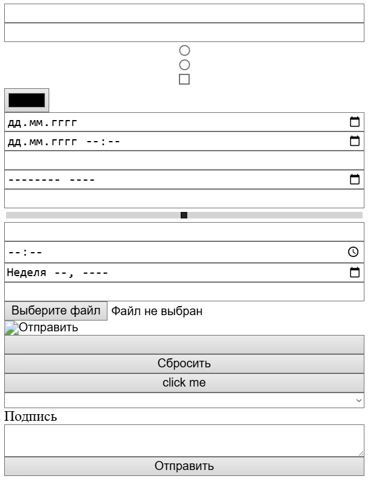

# Работа с формами

[⬅️Назад](./10.%20Работа%20с%20таблицами.md) | [🏠Содержание](../README.md) | [Вперед➡️](./12.%20Семантические%20теги.md)

Формы - основной способ отправки данных.

## Создание

```html
<form></form>
```

Атрибуты `form`:

- `action` - ссылка на скрипт, который должен обрабатывать форму или адрес, на который передадутся данные формы (например, на другой сервер с backend-частью приложения).
- `method` - метод отправки данных:
  - `get` - по умолчанию, ответы пользователя дописываются в URL-адрес страницы в формате "параметр=значение", максимальное ограничение URL-адреса - 3000 символов. Например, следующий адрес является GET-запросом с двумя параметрами: https://yoursite.com/?name=Bob&age=30
  - `post` - данные формы упаковываются в тело формы и отправляются на сервер, за счет этого параметры не видны в URL-запросе, а также нет никаких ограничений по объему данных.
  - `dialog` - используется внутри тега `<dialog>`. При отправке формы диалоговое окно **закрывается**, данные **не отправляются** на сервер. Значение кнопки, нажатой для отправки, становится `returnValue` диалога.
- `name` - имя формы, к которому можно обращаться из скриптов.
- `autocomplete` - по умолчанию включено (on/off), включение или отключение автодополнения в форме.
- `novalidate` - если добавить этот атрибут, то форма не будет проверяться на правильность заполнения браузерными средствами.
- `enctype` - вид кодирования для данных формы:
  - `application/x-www-form-urlencoded` - по умолчанию, кодирует кириллицу в шестнадцатеричном формате, а пробелы в +
  - `multipart/form-data` - данные не кодируются, используется, когда необходимо отправлять файлы
  - `text/plain` - данные отправляются без кодирования в формате `ключ: значение`. Используется крайне редко, в основном для отладки.
- `accept-charset` - задание кодировки, в которой сервер получит данные

> [!WARNING]
> Никогда не используйте метод `GET` для отправки конфиденциальных данных в виду безопасности.
> В основном `GET` используется для поиска и сортировки статей на сайте.

## Элементы формы

Основной элемент - `input`, у которого с помощью атрибута `type` можно указать множество вариантов:

- `text` - текстовое поле (по умолчанию, если не указан атрибут `type`)
- `password` - текстовое поле с заменой символов на \* или кружочки (зависит от браузера) при вводе
- `radio` - радиокнопка (среди группы таких кнопок можно выбрать только одну)
- `checkbox` - флажок
- `hidden` - скрытое поле
- `submit` - кнопка отправки формы
- `color` - поле выбора цвета
- `date` - поле выбора даты
- `datetime-local` - поле для выбора даты со временем с учетом часового пояса (по умолчанию будет текущее время в выборе времени)
- `email` - поле для ввода e-mail
- `month` - поле для ввода месяца и года
- `number` - поле для ввода чисел
- `range` - ползунок для выбора числа из заданного диапазона
- `tel` - поле для ввода телефона
- `time` - поле для ввода времени
- `week` - поле для ввода недели по счету и года
- `url` - поле для ввода URL-адреса
- `file` - поле для загрузки файла
- `image` - кнопка "Отправить" в виде картинки
- `button` - обычная кнопка
- `reset` - кнопка сброса введенных данных

Помимо `input` для формы есть еще несколько элементов:

- `<button></button>` - кнопка
- `<select></select>` - выпадающий список
- `<label></label>` - метка для поля, которая позволяет подписать его
- `<textarea></textarea>` - многострочное текстовое поле



### Атрибуты `input`

`value` - значение элемента `input`.

- Если кнопка (`button`, `reset`, `submit`), то `value` - текст на ней.
- Если `image`, то в качестве `value` передаются координаты нажатия пользователем кнопки в формате `имя_поля.x имя_поля.y`
- Если `text` или `password`, то в качестве `value` можно задать значение по умолчанию, которое пользователь может отредактировать.
- Если `checkbox` или `radio`, то `value` задаст уникальное имя, по которому можно обращаться через скрипт.

`name` - уникальное имя, по которому можно обращаться в скриптах. В случае `checkbox` и `radio` имя задает принадлежность этих типов к определенной группе.

> [!NOTE]
> Для `radio` кнопок группировка по `name` означает, что в группе можно выбрать **только одну** кнопку.
>
> ```html
> <!-- Можно выбрать только один вариант -->
> <input type="radio" name="gender" value="male" /> Мужской
> <input type="radio" name="gender" value="female" /> Женский
> <input type="radio" name="gender" value="other" /> Другой
> ```
>
> Для `checkbox` с одинаковым `name` можно выбрать **несколько** вариантов:
>
> ```html
> <!-- Можно выбрать несколько интересов -->
> <input type="checkbox" name="interests" value="sport" /> Спорт
> <input type="checkbox" name="interests" value="music" /> Музыка
> <input type="checkbox" name="interests" value="books" /> Книги
> ```
>
> При отправке на сервер придет несколько значений с одинаковым ключом: `interests=sport&interests=music&interests=books`

`required` - если атрибут указан, то делает поле обязательным для заполнения.
`disabled` - отключает элемент и делает его возможность ввода недоступной.
`autocomplete` - разрешает автозаполнение браузером поля.

> [!WARNING]
> Для полей ввода паролей и конфиденциальных данных рекомендуется использовать `autocomplete="off"`, чтобы браузер **не сохранял** эти данные.

`autofocus` - автоматический фокус на конкретном элементе (только одном).
`form` - задает принадлежность `input` к конкретной форме по `id`.
`list` - связывает элемент с `<datalist></datalist>` тегом через `id`. Подробнее о `datalist` будет далее.
`readonly` - атрибут только для текстовых полей, запрещающий их изменять, при этом они остаются активными.
`step` - шаг, с которым будет менять значение поля для элементов типа `number`, `range`, `date` и `datetime-local`.
`min`, `max` - минимальные и максимальные пороги для элементов типа `number`, `range`, `date` и `datetime-local`.
`size` - ширина поля для ввода в символах.
`placeholder` - подсказка внутри поля вода, исчезает при осуществлении ввода.
`pattern` - регулярное выражение для проверки корректности ввода.
`multiple` - поддержка множественного выбора среди группы элементов.

### Группировка полей

- `<fieldset>` - группирует связанные поля формы.
- `<legend>` - заголовок группы.

```html
<form>
  <fieldset>
    <legend>Личная информация</legend>
    <label for="name">Имя:</label>
    <input type="text" id="name" name="name" />

    <label for="email">Email:</label>
    <input type="email" id="email" name="email" />
  </fieldset>

  <fieldset>
    <legend>Предпочтения</legend>
    <input type="checkbox" name="newsletter" /> Получать новости
    <input type="checkbox" name="terms" /> Согласен с условиями
  </fieldset>
</form>
```

### `<datalist>`

`<datalist>` предоставляет список подсказок для поля ввода или возможность выбора из списка для `<select>`.

```html
<label for="browser">Выберите браузер:</label>
<input type="text" id="browser" name="browser" list="browsers" />

<datalist id="browsers">
  <option value="Chrome"></option>
  <option value="Firefox"></option>
  <option value="Safari"></option>
  <option value="Edge"></option>
  <option value="Opera"></option>
</datalist>
```

Пользователь начинает вводить текст, и браузер показывает подходящие варианты из списка. В `select` пользователь не может ввести свой вариант, как это происходит в обычном текстовом поле.

### `<textarea></textarea>`

Многострочное поле

Атрибуты:

- `rows` - количество строк (высота)
- `cols` - количество столбцов (ширина)
- `maxlength` - максимальное количество символов
- `wrap` - добавлять ли символы переноса текста при отправке формы, значения `hard` и `soft` (по умолчанию).

### `<select></select>`

Выпадающий список с возможностью выбора.

```html
<label for="city">Город:</label>
<select id="city" name="city">
  <option value="msk">Москва</option>
  <option value="spb">Санкт-Петербург</option>
  <option value="kazan">Казань</option>
  <option value="novosib">Новосибирск</option>
</select>
```

Опции можно группировать:

```html
<select name="product">
  <optgroup label="Фрукты">
    <option value="apple">Яблоки</option>
    <option value="banana">Бананы</option>
  </optgroup>
  <optgroup label="Овощи">
    <option value="carrot">Морковь</option>
    <option value="potato">Картофель</option>
  </optgroup>
</select>
```

Можно настроить множественный выбор, который пользователи смогут делать через CTRL (CMD):

```html
<select name="interests" multiple size="4">
  <option value="sport">Спорт</option>
  <option value="music">Музыка</option>
  <option value="books">Книги</option>
  <option value="cinema">Кино</option>
</select>
```

Для этого просто должен быть указан атрибут `multiple`.

### Стилизация

В зависимости от состояния поля, его можно стилизовать по-разному, для этого есть соответствующие псевдоклассы:

```CSS
/* Обязательные поля */
input:required {
  border-color: blue;
}

/* Невалидные поля */
input:invalid {
  border-color: red;
  background-color: #ffe6e6;
}

/* Валидные поля */
input:valid {
  border-color: green;
  background-color: #e6ffe6;
}

/* Поля в фокусе */
input:focus {
  outline: 2px solid blue;
}
```

- `:valid` - поле заполнено корректно
- `:invalid` - поле заполнено некорректно
- `:required` - поле обязательно для заполнения
- `:optional` - поле необязательное
- `:in-range` - значение в допустимом диапазоне
- `:out-of-range` - значение вне допустимого диапазона

Подробнее о псевдоклассах форм было [здесь](./3.%20Продвинутые%20CSS%20селекторы.md).
