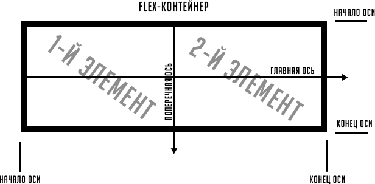
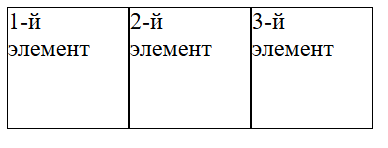
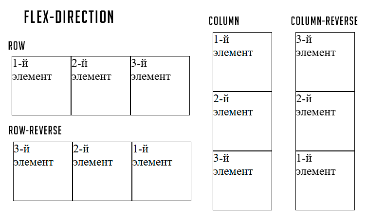
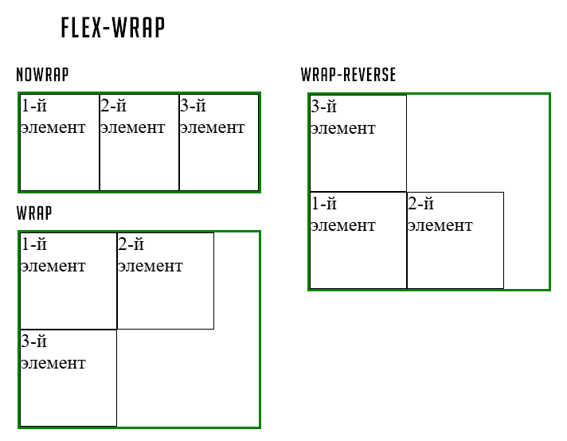
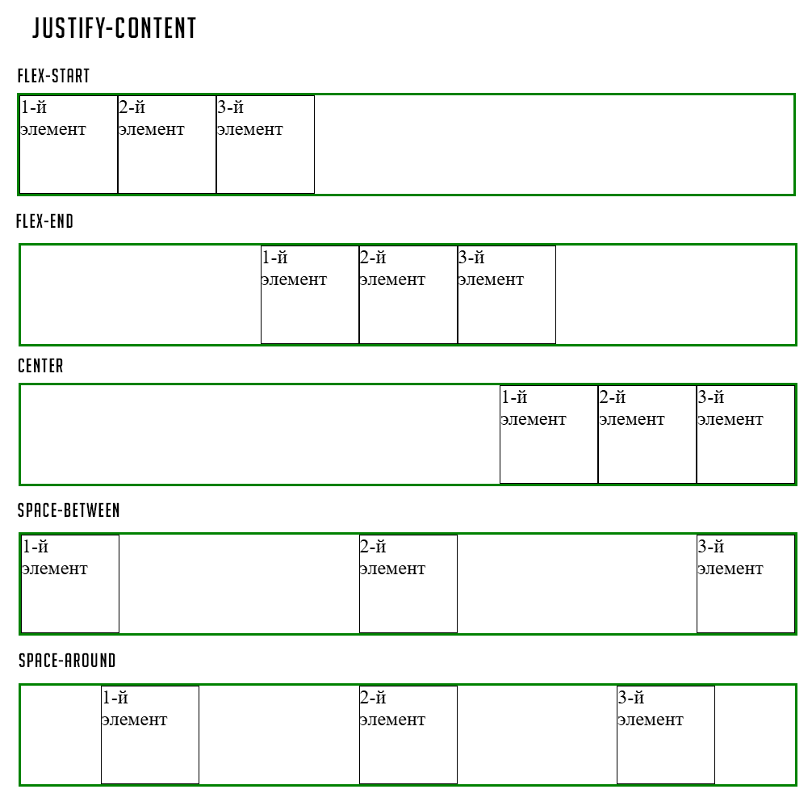
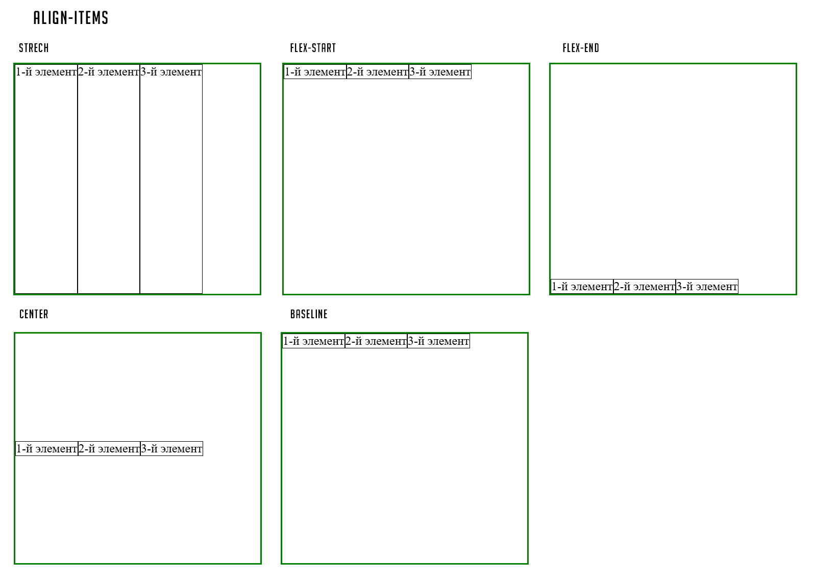
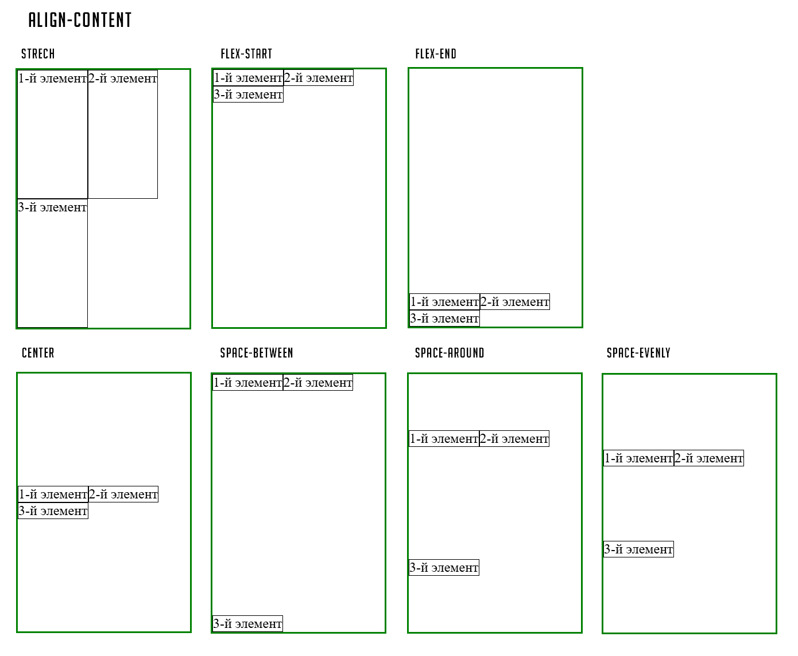
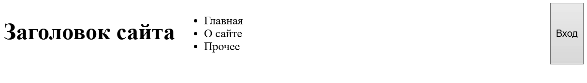

# Flexbox

[⬅️Назад](./12.%20Семантические%20теги.md) | [🏠Содержание](../README.md) | [Вперед➡️](./14.%20Grid.md)

**Flexbox** - особый режим компоновки (верстки) пользовательского интерфейса, полное название которого flex layout.

Разберем устройство Flex-контейнера в базовом варианте:



- Главная ось (main axis) - центральная ось, вдоль которой позиционируются flex-элементы, задает их ширину.
- Поперечная ось (cross axis) - дополнительная ось, задающая высоту flex-элементов

Каждая ось имеет соответствующее направление, а также начало и конец.

## Создание flex-контейнера

Свойство `display` со значениями `flex` и `inline-flex` позволяют создать flex-контейнер блочного и строчного типов соответственно.

```html
<div class="flex">
  <div class="container">1-й элемент</div>
  <div class="container">2-й элемент</div>
  <div class="container">3-й элемент</div>
</div>
```

```css
* {
  box-size: border-box;
}

.flex {
  display: flex;
}

.container {
  width: 80px;
  height: 80px;
  border: 1px solid black;
}
```

Обратите внимание, что элементы сразу выстроились вдоль направления главной оси.
В обычном блочном варианте они бы были в трех разных строках.



## Свойства flex-контейнера

### `flex-direction: значение`

Задание направления главной оси

- `row` - по умолчанию, главная ось расположена стандартно (горизонтально)
- `row-reverse` - главная ось изменяет свое направление на обратное (по-прежнему горизонтальное направление, но в обратную сторону)
- `column` - главная и поперечная ось меняются местами (теперь она расположена вертикально)
- `column-reverse` - главная и поперечная ось меняются местами, направление главной оси меняется на противоположное (в обратную сторону)

> [!WARNING]
> Направление flex-элементов меняется лишь визуально, в HTML-коде по-прежнему будет стандартный порядок.
> Это означает, что люди, использующие скринридер, будут слышать оригинальный порядок.



### `flex-wrap:значение`

Будет ли flex-контейнер пытаться уместить все flex-элементы в одну строку

- `nowrap` - все элементы должны располагаться в одну строку (один столбец для вертикальной главной оси)
- `wrap` - элементы можно переносить на следующую строку (следующий столбец для вертикальной главной оси), если они не умещаются в одну.
- `wrap-reverse` - тот же принцип, что и у `wrap`, просто элементы располагаются в обратном порядке.



_Зеленым прямоугольником на скриншоте является граница flex-контейнера_

### `flex-flow: [flex-direction] [flex-wrap]`

Шорткат для задания сразу двух свойств одновременно

### `justify-content: значение`

Указывает, как выравнивать элементы вдоль направления **главной оси**

- `flex-start` - по умолчанию, flex-элементы выравниваются по левой стороне flex-контейнера.
- `flex-end` - flex-элементы выравниваются по правой стороне flex-контейнера.
- `center` - flex-элементы выравниваются по центру flex-контейнера.
- `space-between` - первый flex-элемент выравнивается по левой стороне flex-контейнера, а последний - по правой. Все остальные элементы распределяются так, чтобы расстояние между ними было равномерным.
- `space-around` - все flex-элементы распределяются от середины таким образом, чтобы расстояние между ними было одинаковым.
- `space-evenly` - расстояние между flex-элементами и краями flex-контейнера будет одинаковым.



### `align-items: значение`

Указывает, как выравнивать элементы вдоль направления **поперечной оси**

- `stretch` - по умолчанию, flex-элементы располагаются по всей высоте (ширине для вертикальной главной оси).
- `flex-start` - flex-элементы располагаются по верхнему краю (левому краю для вертикальной главной оси).
- `flex-end` - flex-элементы располагаются по нижнему краю (правому краю для вертикальной главной оси).
- `center` - flex-элементы выравниваются по центру.
- `baseline` - flex-элементы располагаются на базовой линии flex-контейнера (воображаемая текстовая линия у шрифтов).



### `align-content: значение`

Распределяет свободное пространство по поперечной оси между рядами flex-элементов

- `stretch` - по умолчанию, строки (столбцы) занимают все свободное пространство.
- `flex-start` / `start` - строки (столбцы) выравниваются по началу flex-контейнера (для строк - это верхний край, для столбцов - это левый край flex-контейнера).
- `flex-end` / `end` - строки (столбцы) выравниваются по концу flex-контейнера (строки - по нижнему краю, столбцы - по правому краю).
- `center` - строки (столбцы) располагаются по центру flex-контейнера.
- `space-between` - первый ряд прижимается к началу поперечной оси, последний - к концу поперечной оси, а остальные располагаются так, чтобы свободное пространство было поделено равномерно.
- `space-around` - строки (столбцы) равным образом распределяют пространство контейнера.
- `space-evenly` — отступы между рядами и от краев flex-контейнера одинаковые.

> [!WARNING]
> `align-content` **работает только при многострочном** flex-контейнере (`flex-wrap: wrap` или `wrap-reverse`).



### `gap: значение`

Задает отступы между строками и столбцами в любых единицах измерения, является шорткатом для `row-gap`, `column-gap` (растояние между строками и столбцами, соответственно)

## Свойства flex-элемента

### `order: значение`

Задает порядок отображения элемента во flex-контейнере

- `значение от -1 до n`

> [!WARNING]
> Порядок flex-элементов меняется лишь визуально, в HTML-коде по-прежнему будет стандартный порядок.
> Это означает, что люди, использующие скринридер, будут слышать оригинальный порядок.

### `flex-grow: значение`

Указывает, насколько flex-элемент должен быть растянут больше остальных при наличии свободного места

`flex-grow` - определяет, какую **долю** свободного пространства получит элемент.

### `flex-shrink: значение`

Указывает, насколько flex-элемент будет сжиматься, если места не хватает

- `0` - элемент не сжимается (сохраняет свой размер)
- `1` - элемент сжимается пропорционально (по умолчанию)
- `2` - элемент сжимается в 2 раза сильнее
- `число` - целое или дробное число

### `flex-basis: значение`

Задает начальный размер flex-элемента до того, как к нему будут применены `flex-grow` и `flex-shrink`.

- `auto` - размер берется из `width` (или `height` при `flex-direction: column`)
- `значение` - конкретный размер в любых единицах измерения
- `content` - размер по содержимому

> [!WARNING]
> `flex-basis` имеет приоритет над `width`, но `min-width` и `max-width` работают поверх него.

### `flex: [flex-grow] [flex-shrink] [flex-basis]`

Шорткат для трех свойств сразу

**Часто используемые значения:**

| Значение         | Эквивалент       | Описание                                                          |
| ---------------- | ---------------- | ----------------------------------------------------------------- |
| `flex: 1`        | `flex: 1 1 0%`   | Элемент занимает все доступное место, сжимается при необходимости |
| `flex: none`     | `flex: 0 0 auto` | Элемент **не растягивается** и **не сжимается**                   |
| `flex: auto`     | `flex: 1 1 auto` | Элемент растягивается и сжимается, размер по содержимому          |
| `flex: 0 1 auto` | \-               | По умолчанию (если не задан `flex`)                               |

### `align-self: значение`

Переопределяет свойство `align-items`, заданное во flex-контейнере для одного конкретного flex-элемента

Имеет те же значения, что и в `align-items`.

## Фишки

- Сайт на понимание flexbox: <a href="https://flexboxfroggy.com" target="_blank">тык</a>

- Иногда проще воспользоваться `margin: auto`, чтобы гибко управлять выравниванием flex-элементов.

Например, когда необходимо прижать два flex-элемента к левой стороне, а последний flex-элемент - к правой.

```html
<header>
  <h1>Заголовок сайта</h1>
  <nav>
    <ul>
      <li>Главная</li>
      <li>О сайте</li>
      <li>Прочее</li>
    </ul>
  </nav>
  <button>Вход</button>
</header>
```

```css
header {
  display: flex;
}

button {
  margin-left: auto;
}
```



- В отличие от блочных элементов, во flex-контейнере отступы **не схлопываются**:

```css
.item-1 {
  margin-bottom: 20px;
}
.item-2 {
  margin-top: 30px;
}

/* Итоговый отступ между элементами: 20px + 30px = 50px */
```

- `margin: auto` работает по обеим осям
