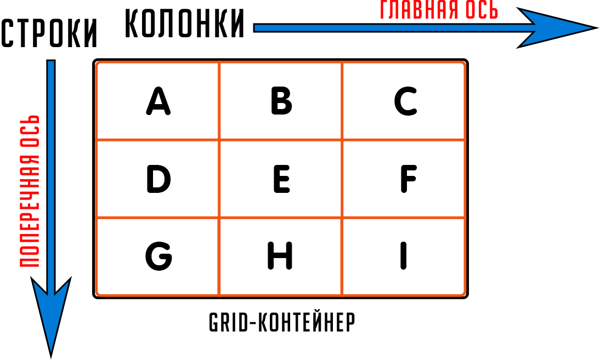
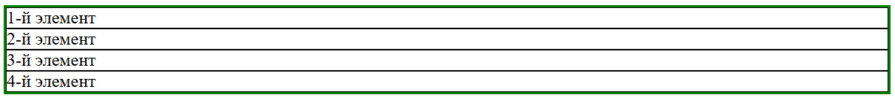
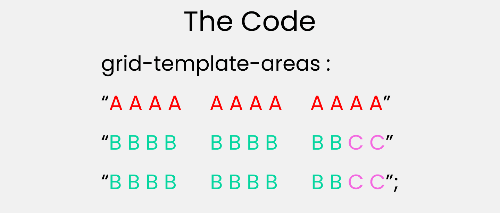
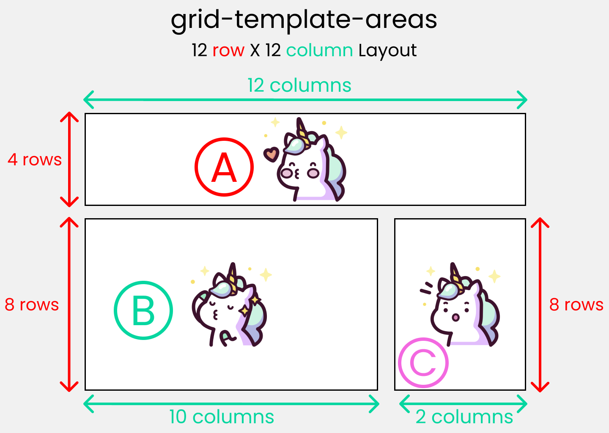

# Grid

[⬅️Назад](./13.%20Flexbox.md) | [🏠Содержание](../README.md) | [Вперед➡️](./15.%20Методология%20БЭМ.md)

**Grid Layout** - режим компоновки (верстки) пользовательского интерфейса, основанный на сеточном позиционировании элементов, напоминающим таблицу.

Разберем устройство Grid-контейнера:



- grid-элементы расположены вдоль главной и поперечной оси одновременно.
- **grid-линия** - разделительная линия, используемая для привязки grid-элементов, отступы между ячейками находятся на ней.
- **grid-ячейка** - пространство между соседними grid-линиями.
- **grid-полоса (grid-track)** - строка или столбец из grid-контейнера.
- **grid-область (grid-area)** - область, ограниченная четырьмя grid-линиями с каждой стороны.

## Создание grid-контейнера

Свойство `display` со значениями `grid` или `inline-grid` позволяют создать grid-контейнер. Отличия между ними лишь в том, что снаружи такой grid-контейнер будет строчного типа.

```html
<div class="grid">
  <div class="container">1-й элемент</div>
  <div class="container">2-й элемент</div>
  <div class="container">3-й элемент</div>
  <div class="container">4-й элемент</div>
</div>
```

```css
* {
  box-sizing: border-box;
}

.grid {
  display: grid;
  border: 2px solid green;
}

.container {
  border: 1px solid black;
}
```

Каждый grid-элемент занял новую строку:



## Свойства grid-контейнера

### `grid-template-columns: значения` и `grid-template-rows: значения`

Задает количество и размеры колонок/рядов grid-контейнера

- `auto` - ячейка займет все оставшееся доступное пространство
- `значение` - конкретное значение в любых единицах измерения
- `fr` - доля, которую должна занять ячейка по сравнению с другими
- `repeat(n, значение)` - задает количество ячеек определенного размера (все одинаковые)
- `subgrid` - значение наследуется от grid-родителя
- `auto-fill` - заполнение колонками всего доступного пространства. Когда место заканчивается, создает пустую область, равномерно распределяя область между существующими и виртуальными колонками/рядами.
- `auto-fit` - то же самое, но дает больше места под заполненные колонки/ряды.

Для читаемости можно именовать колонки/ряды с помощью следующего синтаксиса:

```css
.container {
  display: grid;
  grid-template-columns: [start] 250px [line2] 400px [line3] 600px [end];
  grid-template-rows: [row1-start] 15rem [row1-end] 30vh [last];
}
```

### `grid-template: [grid-template-rows] [grid-template-columns] [grid-template-areas]`

Шорткат для задания одновременно двух свойств, имеет плохую читаемость, если колонок и рядов много.

Включает также в себя свойство `grid-template-areas`.

### `grid-template-areas: значения`

Распределяет пространство grid-контейнера для ячеек в терминах колонок и рядов согласно шаблону.

- `.` - пустое пространство
- `название` - название области

_Для использования grid-ячейка обязательно должна иметь свойство `grid-area`._




### `grid-auto-columns: значения`, `grid-auto-rows: значения`

Если элементы не помещаются в заданные столбцы/колонки, то для них создаются автоматические неявные колонки/ряды.

Свойства `grid-auto-columns` и `grid-auto-rows` задают размеры для таких неявных колонок/рядов. Причем можно задавать разные размеры для последующих неявных столбцов:

```css
.container {
  display: grid;
  grid-template-columns: 1fr 1fr; /* 2 явные колонки */
  grid-auto-rows: 200px; /* Неявные ряды будут по 200px */
}
```

### `grid-auto-flow: значение`

Свойство объявляет, как именно расширять grid-контейнер для неявных колонк/рядов.

- `row` - по умолчанию, элементы выстраиваются в ряды.
- `column` - элементы выстраиваются в колонки.
- `dense` - браузер должен пытаться заполнить пустые пространства grid-контейнера.

### `gap: [row-gap] [column-gap]`

Шорткат для задания отступа между рядами и колонками.

- `значение` - одинаковый отступ для рядок в колонок
- `значение значение` - конкретные отступы для рядов, затем колонок.

### `justify-content: значение`

Вравнивание элементов вдоль строчной оси

Чтобы выравнивание было применимо, необходимо свободное пространство вдоль строчной оси grid-контейнера.

- `start` - выравнивание по левой стороне
- `end` - выравнивание по правой стороне
- `center` - выравнивание по центру
- `stretch` - масштабирование элементов, чтобы сетка заполнила всю ширину grid-контейнера.
- `space-around` - одинаковое расстояние между элементами и половина размера элемента в качестве отступа по краям grid-контейнера.
- `space-evenly` - одинаковые отступы между элементами и краями grid-контейнера
- `space-between` - одинаковые отступы между элементами без отступов по краям.

### `align-content: значение`

Выравнивание элементов вдоль вертикальной оси

Чтобы выравнивание было применимо, необходимо свободное пространство вдоль вертикальной оси grid-контейнера.

Значения такие же, как и в `justify-content`.

### `justify-items: значение`

Выравнивание элементов по горизонтальной оси внутри своих grid-областей.

- `start` - выравнивание по верхнему левому краю.
- `end` - выравнивание по нижнему правому краю.
- `center` - выравнивание по центру.
- `stretch` - растягивание элементов на всю ширину ячейки при условии, что не задан фиксированный размер.

### `align-items: значение`

Выравнивание элементов по вертикальной оси внутри своих grid-областей.

- `start` - выравнивание по верхней линии.
- `end` - выравнивание по нижней линии.
- `center` - выравнивание по центру grid-ячейки.
- `stretch` - растягивание элемента по всей высоте grid-ячейки.

### `place-items: [align-items] [justify-items]`

Шорткат для задания двух свойств одновременно

### `grid: [grid-template-rows] [grid-template-columns] [grid-template-areas] [grid-auto-rows] [grid-auto-columns] [grid-auto-flow]`

Шорткат, вмещающий множество свойств для управления количеством колонок и рядов.

## Свойства grid-элементов

### `grid-column-start: значение`, `grid-column-end: значение`, `grid-row-start: значение`, `grid-row-end: значение`

Указывают, с какой по какую grid-линию должен занимать элемент.

```css
.item {
  grid-column-start: 1; /* Начинается с 1-й вертикальной линии */
  grid-column-end: 3; /* Заканчивается на 3-й вертикальной линии */
  grid-row-start: 2; /* Начинается со 2-й горизонтальной линии */
  grid-row-end: 4; /* Заканчивается на 4-й горизонтальной линии */
}
```

### `grid-column: значения` и `grid-row: значения`

Шорткаты для задания начальной и конечной линии через /:

```css
.item {
  grid-column: 1 / 3; /* С 1-й по 3-ю линию */
  grid-row: 2 / 4; /* Со 2-й по 4-ю линию */
}

/* Можно использовать ключевые слова */
.item {
  grid-column: 1 / span 2; /* Начинается с 1-й, занимает 2 колонки */
  grid-row: 2 / span 3; /* Начинается со 2-й, занимает 3 строки */
}

/* От конца */
.item {
  grid-column: -2 / -1; /* Предпоследняя и последняя колонки */
}
```

### `grid-area: значения`

Задает имя области для использования в grid-template-areas или объединяет 4 линии в одном свойстве.

```css
.header {
  grid-area: header;
}

.item {
  grid-area: 2 / 1 / 4 / 3;
  /* row-start / column-start / row-end / column-end */
}
```

### `justify-self: значение` и `align-self: значение`

Переопределяют `justify-items` и `align-items` для конкретного элемента и имеют те же значения.

### `place-self: [align-self] [justify-self]`

Шорткат для `align-self` и `justify-self`.

## Способы адаптивности

При задании шаблона размеров элементов можно использовать значение `minmax`. Оно позволяет задать минимальное и максимальное значения, которые должен занимать элемент в grid-контейнере.

```css
.container {
  grid-template-columns: 200px 1fr minmax(100px, 500px);
  /* 3 колонки: 200px, 1 фракция и последняя должна занимать не менее 100px и не более 500px */
  grid-auto-rows: minmax(100px, auto);
  /* для строк с незаданными размерами высота будет от 100px до размера содержимого */
}
```

## Фишки

- Сайт на понимание Grid: <a href="https://cssgridgarden.com" target="_blank">тык</a>
- Отличная статья на Хабре про Grid: <a href="https://habr.com/ru/companies/macloud/articles/564182/" target="_blank">тык</a>
- Grid стоит использовать вместо Flexbox, когда необходимо сверстать сложную сетку, меняющуюся в зависимости от размеров экрана устройства.
