# Фильтры CSS

[⬅️Назад](./16.%20Работа%20с%20аудио%20и%20видео.md) | [🏠Содержание](../README.md) | [Вперед➡️](./18.%20Трансформации,%20переходы%20и%20анимации.md)

**Фильтры** - эффекты поверх картинок и фонов стандартными средствами CSS.

Свойства `filter` и `backdrop-filter` имеют одинаковые значения. На одном изображении можно использовать несколько фильтров, перечисляя их через пробел.

Оригинальное изображение для сравнения в примерах:

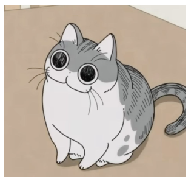

## blur

Размытие по Гауссу в любых единицах измерения, кроме процентов.

```CSS
img {
  filter: blur(2px);
}
```

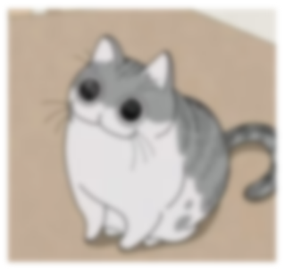

## brightness

Изменение яркости в процентах, где 100% - стандартная яркость.

```CSS
img {
  filter: brightness(30%);
}
```

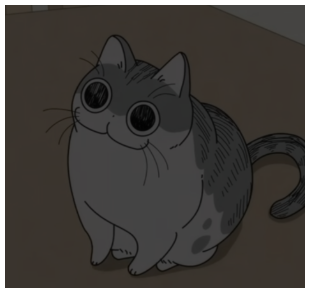

## contrast

Изменение контрастности в процентах, где 100% - стандартная контрастность.

```CSS
img {
  filter: contrast(150%);
}
```

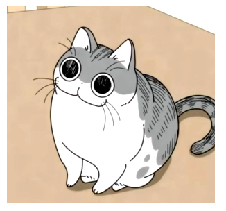

## drop-shadow

Тень для картинки по аналогии с `box-shadow`, за исключением отсутствия значения `inset`.

```CSS
img {
  filter: drop-shadow(4px 4px green);
}
```

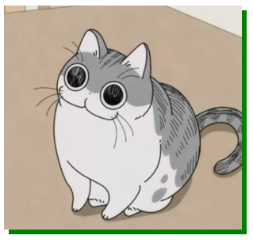

> [!NOTE]
> Главное отличие `drop-shadow` от `box-shadow` в том, что учитывается альфа-канал (прозрачность) в изображении. А значит, тень будет обрамлять форму прозрачного изображения, а не квадрата.
>
> ```CSS
>  .img1 {
>    filter: drop-shadow(16px 18px 0px rgba(242, 17, 17, 1));
>  }
>
>  .img2 {
>    box-shadow: 16px 18px 0px 0px rgba(242, 17, 17, 1);
>  }
> ```
>
> 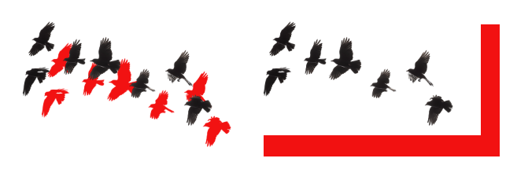

## grayscale

Делает изображение черно-белым в процентах, где 0% - стандартное изображение.

```CSS
img {
  filter: grayscale(80%);
}
```

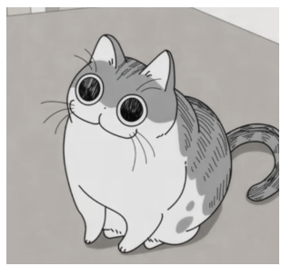

## hue-rotate

Изменение цветов в изображении путем поворота цветового круга на определенный градус `deg` или поворот `turn`.

```CSS
img {
  filter: hue-rotate(90deg);
}
```

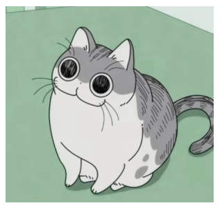

## invert

Инвертирование цветов в процентах, где 0% - нормальное изображение.

```CSS
img {
  filter: invert(100%);
}
```

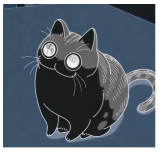

## opacity

Изменение прозрачности в процентах, где 100% - стандартное изображение.

```CSS
img {
  filter: opacity(50%);
}
```

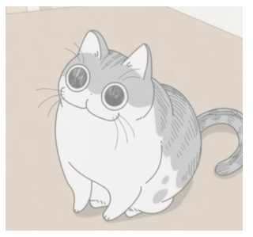

## saturate

Изменение насыщенности в процентах, где 100% - стандартное изображение.

```CSS
img {
  filter: saturate(10%);
}
```

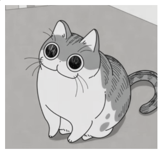

## sepia

Замена цветов в изображении на сепию - коричневые оттенки - в процентах, где 0% - стандартное изображение.

```CSS
img {
  filter: sepia(50%);
}
```

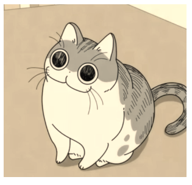
