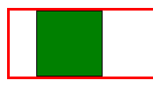
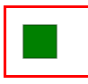
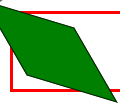
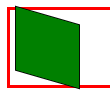
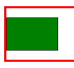
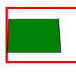

# Трансформации, переходы и анимации

[⬅️Назад](./17.%20Фильтры%20CSS.md) | [🏠Содержание](../README.md) | [Вперед➡️](./)

> [!NOTE]
> Для демонстрации создадим простой блочный элемент, находящийся в контейнере:
>
> ```CSS
>  * {
>    box-sizing: border-box;
>  }
>  .element {
>    width: 50px;
>    height: 50px;
>    background-color: green;
>    border: 1px solid black;
>  }
>
>  .container {
>    border: 2px solid red;
>  }
> ```
>
> ```HTML
> <div class="container">
>  <div class="element"></div>
> </div>
> ```

## Трансформации

Благодаря свойству `transform` к элементу можно применять трансформации: вращение, масштабирование, наклон и перемещение.

### `translate(X, Y)`

Смещение элемента в любых единицах измерения.

```CSS
.element:hover {
  transform: translate(20px);
}
```

Элемент сдвигается вправо на 20px при наведении:



Можно смещать элемент по одной конкретной оси, для этого есть соответствующие свойства:

- translateX(X)
- translateY(Y)
- translateZ(Z)

Для задания всех трех осей одновременно используется свойство `translate3d(X, Y, Z)`.

### `scale(X, Y)`

Масштабирование элемента:

- Уменьшение: от 0 до 1, где 0 - элемент исчезает, 1 - стандартный масштаб элемента.
- Увеличение: больше 1.
- X - масштабирование по оси X.
- Y - масштабирование по оси Y.
- При указании одного параметра, X и Y будут масштабироваться одинаково.
- `scaleX(X)`, `scaleY(Y)`, `scaleZ(Z)` - свойства для задания масштабирования по одной конкретной оси.
- `scale3d(X, Y, Z)` - масштабирование по трем осям одновременно.

```CSS
.element:hover {
  transform: scale(0.5);
}
```

Уменьшение элемента наполовину при наведении:



### `skewX(X)`, `skewY(Y)`

Наклон элемента в градусах (`deg`) или оборотах (`turn`)

```CSS
.element:hover {
  transform: skewX(30deg) skewY(20deg);
}
```

Элемент наклонился на 30 градусов по X и на 20 градусов по Y:



### `rotateX(X)`, `rotateY(Y)`, `rotateZ(Z)`

Вращение элемента в градусах (`deg`) или оборотах (`turn`)

```CSS
.element:hover {
  transform: rotateX(30deg) rotateY(30deg);
}
```

Элемент повернулся на 30 градусов по осям X и Y:



- Используя ключевое слово `rotate`, поворот будет происходить только по оси Z.
- `rotate3d(X, Y, Z)` позволяет задать поворот сразу по трем осям одновременно.

### `matrix(a, b, c, d, tx, ty)`

Любая трансформация в плоскости экрана за счет матричных преобразований. Используется в сложных анимациях в библиотеках.

- `matrix3d(a1, b1, c1, d1, a2, b2, c2, d2, a3, b3, c3, d3, a4, b4, c4, d4)` - используется, когда необходимо реализовать сложную анимацию в трехмерном пространстве.

### `perspective(Z)`

Изменение перспективы элемента вдоль оси Z

```CSS
.element:hover {
  transform: perspective(500px) rotateX(50deg);
}
```

Простой поворот на 50 градусов:



Поворот на 50 градусов с измененной на 500px перспективой:



## Переходы

Используются для плавного изменения CSS-свойства между двумя состояниями. Создаются с помощью свойства `transition`, являющегося шорткатом.

`transition: [transition-property] [transition-duration] [transition-timing-function] [transition-delay]`

- `transition-property` - свойство, которое нужно плавно изменять
- `transition-duration` - длительность перехода
- `transition-timing-function` - функция, описывающая скорость изменения
- `transition-delay` - задержка перед началом изменения

Задавать шорткат можно по-разному:

- `transition: [transition-property] [transition-duration]` - длительность перехода у свойства
- `transition: [transition-property] [transition-duration] [transition-delay]` - длительность и задержка перехода у свойства
- `transition: [transition-property] [transition-duration], [transition-property] [transition-duration]` - два и более свойства

### `transition-property`

- `all` - применить плавное изменение ко всем свойствам.
- `color, margin-left` - применить плавное изменение к конкретным свойствам

### `transition-duration`

- `s` - значение в секундах
- `ms` - значение в миллисекундах

### `transition-timing-function`

- `linear` - равномерное изменение по времени
- `ease` - по умолчанию, ускорение к середине и замедление в конце
- `ease-in` - медленное начало и ускорение в конце
- `ease-out` - быстрое начало и замедление в конце
- `ease-in-out` - медленно начинается и заканчивается, а к середине ускоряется
- `cubic-bezier` - кубическая фунция Безье с параметрами

### `transition-delay`

- `s` - значение в секундах
- `ms` - значение в миллисекундах

## Анимации

Продвинутый вариант переходов, в котором могут быть несколько состояний, а не только начальное и конечное.

## Полезные сайты

- https://animista.net - полная кастомизация анимаций, переходов и трансформаций
- https://cubic-bezier.com - кастомизация кривой Безье
