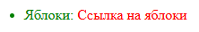
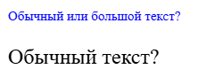

# Введение в CSS

[⬅️Назад](./1.%20Введение%20в%20HTML.md) | [🏠Содержание](../README.md) | [Вперед➡️](./3.%20Продвинутые%20CSS%20селекторы.md)

**CSS (Cascading Style Sheets)** - язык таблиц стилей, задающий внешнее представление для HTML-документа.

## Каскад

> [!NOTE]
>
> **Каскад** - это механизм, который определяет, какое правило применить к элементу, если присутствуют противоречия:
>
> - Важность `!important`
> - Специфичность (вес селектора)
> - Порядок подключения (правило, объявленное позже, перевешивает равносильное по весу)

## Структура стилей

Структура каждого стиля следующая:

```css
селектор {
  свойство: значение;
}
```

где:

- `свойство` - идентификатор действия, применимого к элементу (граница, цвет, размер и т. д.)
- `значение` - допустим(-о/-ы)е для свойства значени(-е/-я)

Например:

```css
.text {
  font-size: 12px;
}
```

где:

- `.text` - селектор
- `font-size` - свойство
- `12px` - значение

## Типы селекторов

1. Универсальный селектор

Позволяет задать стиль для всех элементов HTML-документа.

```css
* {
  box-sizing: border-box;
  margin: 0;
  padding: 0;
}
```

2. Класс

`class` - основной инструмент для стилизации.
Может применяться к множеству элементов (вес 10).

```css
.text {
  font-size: 12px;
}
```

3. Идентификатор

`id` - уникальный идентификатор элемента (один на HTML-документ).
Используется для якорных ссылок (о них будет рассказано в следующем разделе) и доступа из JavaScript.
Для стилизации используется редко, так как имеет высокую специфичность (вес 100), что делает переопределение стилей сложным.

```html
<main>
  <!-- Указываем id для заголовка, чтобы использовать его в якорной ссылке -->
  <h2 id="technic">Техника</h2>
  <p class="text">Какой-либо текст про технику...</p>
</main>
```

4. Тег

Обращение к конкретному HTML-тегу. Имеет вес 1.

```css
main {
  text-align: center;
}
```

5. Продвинутые селекторы

О них будет рассказано в [следующем разделе](./3.%20CSS%20селекторы.md).

## Группировка и вложенность

Чтобы применить один и тот же стиль для нескольких селекторов, нужные селекторы перечисляются через запятую:

```css
.header_text,
.footer_text {
  font-size: 12px;
}
/* Элементы с классами header_text и footer_text будут иметь размер шрифта 12px */
```

Если необходимо обратиться к дочернему элементу у какого-либо родителя, то оба этих селектора пишутся через пробел:

```css
.main p {
  color: green;
}
/* Все теги p, находящиеся внутри (НА ЛЮБОМ УРОВНЕ ВЛОЖЕННОСТИ) элемента с классом .main, будут иметь зеленый цвет текста */
```

> [!WARNING]
> Пусть имеется, например, следующая структура:
>
> ```html
> <ul>
>   <li class="link">Яблоки: <a class="link">Ссылка на яблоки</a></li>
> </ul>
> ```
>
> Сравним селектор `li .link` с пробелом и без:
>
> ```css
> li .link {
>   color: red;
> }
> /* Все элементы с классом .link, находящиеся внутри тега li, будут иметь красный цвет текста */
>
> li.link {
>   color: green;
> }
>
> /* Все теги li с классом .link будут иметь зеленый цвет текста */
> ```
>
> Результат:
> 

## Приоритетность (специфичность) стилей

Вес селекторов считается по правилу:
`id` > `class` > `тег`

Если у селекторов разный вес, побеждает тот, у кого он больше (независимо от того, что написано ниже в файле).
Если вес одинаковый — вступает в силу [каскад](#каскад), и применяется правило, объявленное позже.

```html
<p class="text">Простой текст с class</p>
<p class="another_text" id="another_text">Текст с id и class</p>
```

```css
/* Одинаковый вес у классов */
.text {
  font-size: 2px;
  color: green;
} /* Вес: 10 */

.text {
  font-size: 10px;
} /* Вес: 10 (одинаковый) => побеждает этот селектор и свойство font-size переопределяется */
/* В результате, получим зеленый текст размера 10px */

/* class против id */
#another_text {
  color: red;
} /* Вес: 100 => перебьет class */

.another_text {
  color: green;
} /* Вес: 10 */
/* В результате, получим текст красного цвета */
```

### Рассчет веса у составных селекторов

Когда селекторы комбинируются, их веса складываются:

```css
/* Вес: 1 */
p {
  color: black;
}

/* Вес: 10 + 1 = 11 (класс + тег) */
p.text {
  color: blue;
}

/* Вес: 10 + 10 = 20 (два класса) */
.text.big {
  font-size: 20px;
}

/* Вес: 100 + 10 = 110 (id + класс) */
#main .text {
  font-size: 10px;
}
```

**Задача:**
Необходимо определить по весам и селекторам выше, какого цвета и размера будет текст у тегов.

```html
<main id="main">
  <p class="text">Обычный или <span class="big">большой</span> текст?</p>
  <p>Обычный текст?</p>
</main>
```

<details>
<summary>Ответ</summary>
<ol>
  <li><b>Первый абзац (p с класом .text)</b></li>
  К нему применимы все селекторы и побеждают два из них (#main .text и p.text), так как имеют наибольший вес. В результате, получаем текст размера 10px голубого цвета.
  <li><b>Слово "большой" (span с классом big)</b></li>
  От родителя унаследован голубой цвет и размер текста 10px, селектор .text.big не применим, так как нет класса .text у тега span.
  <li><b>Второй абзац (обычный тег p)</b></li>
  Применим один селектор тега p, задающий черный цвет текста.
</ol>

</details>
