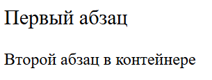
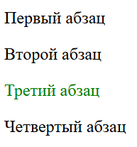
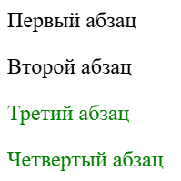
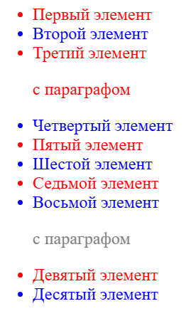
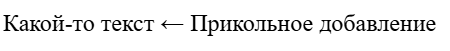

# Продвинутые CSS селекторы

[⬅️Назад](./2.%20Введение%20в%20CSS.md) | [🏠Содержание](../README.md) | [Вперед➡️](./)

Помимо перечисленых в прошлом разделе селекторов, имеются более продвинутые варианты селекторов.

## Селектор дочернего элемента

Селектор `>` позволяет выбрать только те дочерние элементы, которые находятся на первом уровне вложенности по отношению к родителю.

```html
<main>
  <p>Первый абзац</p>
  <div>
    <p>Второй абзац в контейнере</p>
  </div>
</main>
```

```css
main > p {
  font-size: 20px;
}
/* Большим станет только первый абзац */
```



## Селекторы элементов одного уровня

Селектор `+` выбирает первый смежный с определенным элементом.

```html
<main>
  <p>Первый абзац</p>
  <p class="first">Второй абзац</p>
  <p>Третий абзац</p>
  <p>Четвертый абзац</p>
</main>
```

```css
.first + p {
  color: green;
}
/* Зеленым станет третий абзац, идущий сразу после второго с классом .first */
```



Селектор `~` позволяет выбрать все смежные элементы с определенным.

```html
<main>
  <p>Первый абзац</p>
  <p class="first">Второй абзац</p>
  <p>Третий абзац</p>
  <p>Четвертый абзац</p>
</main>
```

```css
.first ~ p {
  color: green;
}
/* Зеленым станут все абзацы, смежные с абзацем с классом .first */
```



## Псевдоклассы

**Псевдокласс** - ключевое слово в дополнение к селектору, определяющее его особое состояние.

Список псевдоклассов довольно обширен, подробнее о каждом можно прочитать [здесь](https://developer.mozilla.org/ru/docs/Web/CSS/Reference/Selectors/Pseudo-classes){target="\_blank"}.
В данном же разделе будут рассмотрены основные псевдоклассы, используемые повседневно.

- `:root` - селектор корневого элемента. Конкретно для HTML - это тег `<html>`.
- `:link` - ссылка внутри элемента.
- `:visited` - посещенные пользователем ссылки.
- `:active` - элемент, когда он активируется пользователем.
- `:hover` - элемент, на который пользователь навел мышкой.
- `:focus` - элемент, получивший фокус (состояние, когда пользователь кликнул по полю ввода или элемент выбран клавишей Tab).
- `:not` - исключение конкретного элемента из выбора селектора.
- `:lang` - выбор элементов в зависимости от языка, на котором они определены.
- `:empty` - элементы без вложенных тегов.

Пример использования псевдокласса `:hover`:

```html
<a class="example">Наведись на меня мышкой</a>
```

```css
.example:hover {
  color: green;
}
```

<style>
  .example:hover {
    color: green;
  }
</style>

Результат:

<a class="example">Наведись на меня мышкой</a>

### Псевдоклассы дочерних элементов

Есть группа псевдоклассов, позволяющая выбирать дочерние элементы особым образом:

- `:first-child` - первый дочерний элемент
- `:last-child` - последний дочерний элемент
- `:only-child` - единственный дочерний элемент
- `:only-of-type` - единственный дочерний элемент своего типа у родителя
- `:nth-child(n)` - дочерний элемент под номером n. Данный псевдоэлемент позволяет выбирать несколько дочерних элементов следующим образом:
  - odd - все нечетные номера;
  - even - все четные номера;
  - 2n+1 - число со знака + говорит, с какого элемента начать, а 2n означает правило определения следующего элемента. В данном примере выбирается каждый второй нечетный элемент. `n` является заменителем номера, по которому и определяется порядок выбора элементов.
- `:nth-last-child(n)` - то же самое, что и `:nth-child(n)`, но порядок выбора элементов начинается с конца.
- `:nth-of-type(n)` - то же самое, что и `:nth-child(n)`, но выбираются элементы по определенному типу.
- `:nth-last-of-type(n)` - то же самое, что и `:nth-of-type(n)`, но порядок выбора элементов начинается с конца.

**Задача:**

```html
<ul>
  <li>Первый <a>элемент</a></li>
  <li>Второй элемент</li>
  <li>
    Третий <a>элемент</a>
    <p>с параграфом</p>
  </li>
  <li>Четвертый элемент</li>
  <li>Пятый элемент</li>
  <li>Шестой элемент</li>
  <li>Седьмой <a>элемент</a></li>
  <li>
    Восьмой элемент
    <p>с параграфом</p>
  </li>
  <li>Девятый элемент</li>
  <li>Десятый элемент</li>
</ul>
```

Дан список из `li` элементов, необходимо стилизовать его по следующим правилам:

1. Нечетные элементы начиная с конца, должны иметь синий цвет.
2. Элементы с первого и через один, должны иметь красный цвет, если какой-то среди них имеет ссылку, то необходимо окрасить ее в зеленый при наведении мышкой.
3. Если в элементы `li` вложены теги `p`, то они должны иметь серый цвет, если являются единственными потомками своего типа.



<details>
  <summary>Ответ</summary>
  <code>
    li:nth-last-child(odd) {
      color: blue;
    }

    li:nth-child(2n+1) {
      color: red
    }

    li:nth-child(2n+1) a:hover {
      color: green;
    }

    p:only-of-type {
      color: gray;
    }

  </code>
</details>

### Псевдоклассы форм

Существуют специальные псевдоклассы для форм:

- `:enabled` - включенные элементы (элемент является включенным, если у него отсутствует атрибут disabled).
- `:disabled` - отключенные элементы.
- `:checked` - отмеченные элементы (касается флажков и радиокнопок, когда они выбраны).
- `:default` - элементы формы, в которых присутствует значение по умолчанию.
- `:valid` - элементы, значения которых проходят валидацию.
- `:invalid` - элементы, значения которых не проходят валидацию.
- `:in-range` - элементы, значения которых соответствуют указанному диапазону (касается элементов типа ползунка).
- `:out-of-range` - элементы, значения которых выходят за указанный диапазон.
- `:required` - элементы с атрибутом required (обязательные для заполнения поля формы).
- `:optional` - элементы без атрибута required (необязательные для заполнения поля формы).

## Псевдоэлементы

**Псевдоэлемент** - ключевое слово, позволяющее стилизовать определенную часть элемента.

- `::after` - добавление дополнительного контента после элемента. Важно отметить, что псевдоэлемент можно стилизовать, но он не является частью структуры HTML-документа.

Чтобы указать содержимое контента, используется свойство `content`:

```html
<p>Какой-то текст</p>
```

```css
p::after {
  content: " ← Прикольное добавление";
}
```



- `::before` - добавление дополнительного контента до элемента. Имеет точно такой же синтаксис, как и `::after`.
- `::first-letter` - первая буква из текста.
- `::first-line` - первая строка текста.
- `::selection` - элементы, выделенные мышкой.
- `::placeholder` - текст placeholder, который указан в тегах `input` или `textarea`.
- `::marker` - маркер списка
- `::spelling-error` - фрагмент текста, который отмечен как орфографическая ошибка.
- `::grammar-error` - фрагмент текста, который отмечен как грамматическая ошибка.
- И еще часть специфических псевдоэлементов, про которые можно почитать [здесь](https://developer.mozilla.org/ru/docs/Web/CSS/Reference/Selectors/Pseudo-elements).

## Селекторы атрибутов

Существует возможность выбирать элементы по атрибутам:

```css
/* ^ - все элементы, атрибут которых начинается с определенного текста */
a[href^="https://"] {
}

/* $ - все элементы, атрибут которых заканчивается определенным текстом */
img[src$=".png"] {
}

/* * - все элементы, атрибут которых содержит схождение определенного текста */
a[href*="google"] {
}
```
