# Блочные элементы

[⬅️Назад](./4.%20Работа%20с%20текстом.md) | [🏠Содержание](../README.md) | [Вперед➡️](./6.%20Блочные%20vs%20строчные%20элементы.md)

Структура блочного элемента следующая:
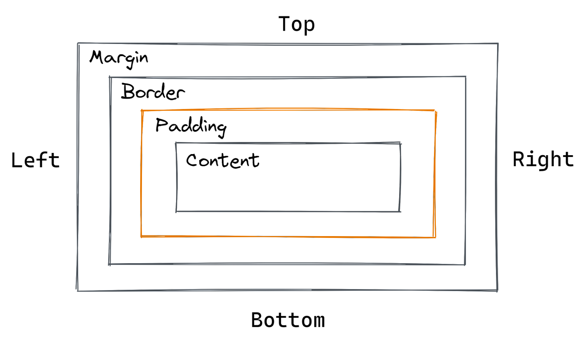

- margin - внешний отступ у элемента
- outline - граница вне элемента
- border - граница элемента
- padding - внутреннний отступ у элемента
- content - само содержимое элемента

## Работа с отступами

### `margin`

Шорткат для задания внешнего отступа у элемента

- `margin: [top] [right] [bottom] [left]` - задание значений с каждой из четырех сторон.
- `margin: [top] [left-right] [bottom]` - задание значений: верх, лево-право, низ.
- `margin: [top-bottom] [left-right]` - задание значений: верх-низ, лево-право.
- `margin: значение` - задание одного значения для каждой стороны.

> [!TIP]
> Легко запомнить порядок, если представлять, что идешь по направлению часовой стрелки.
>
> 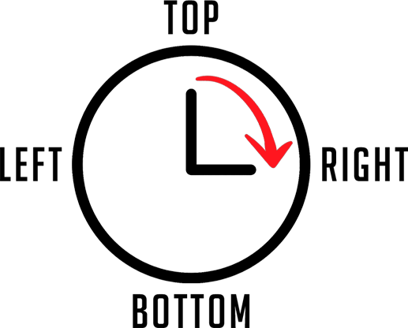

Если необходимо задать отступ только у одной стороны, используется конкретное свойство:

- `margin-top: значение` - внешний отступ сверху.
- `margin-right: значение` - внешний отступ справа.
- `margin-bottom: значение` - внешний отступ снизу.
- `margin-left: значение` - внешний отступ слева.

Существует современный вариант задания внешних отступов с учетом особенности направления чтения в разных странах:

- `margin-block-start: значение` - внешний отступ по вертикали, начало направления (сверху)
- `margin-block-end: значение` - внешний отступ по вертикали, конец направления (снизу)
- `margin-inline-start: значение` - внешний отступ по горизонтали, начало направления (слева)
- `margin-inline-end: значение` - внешний отступ по горизонтали, конец направления (справа)
- `margin-block: значение` - шорткат для внешнего отступа по вертикали (верх-низ)
- `margin-inline: значение` - шорткат для внешнего отступа по горизонтали (лево-право)

> [!NOTE]
> `margin` может быть отрицательным, тогда он начнет "наезжать" на другие элементы.
> Такой трюк применяется крайне редко, когда необходимо разместить один элемент чуть-чуть поверх другого.
> В остальных же случаях считается плохой практикой, так как ломает естественный поток документа.

> [!NOTE]
> Значение `margin: 0 auto` позволяет центрировать элемент при условии, что он обернут в другой блочный элемент с заданной шириной.
> Ключевое слово `auto` говорит браузеру о том, что необходимо равномерно распределить отступы между левым и правым краем.

### `padding`

Шорткат для задания внутреннего отступа у элемента

- `padding: [top] [right] [bottom] [left]` - задание значений с каждой из четырех сторон.
- `padding: [top] [left-right] [bottom]` - задание значений: верх, лево-право, низ.
- `padding: [top-bottom] [left-right]` - задание значений: верх-низ, лево-право.
- `padding: значение` - задание одного значения для каждой стороны.

Если необходимо задать отступ только у одной стороны, используется конкретное свойство:

- `padding-top: значение` - внутренний отступ сверху.
- `padding-right: значение` - внутренний отступ справа.
- `padding-bottom: значение` - внутренний отступ снизу.
- `padding-left: значение` - внутренний отступ слева.

Существует современный вариант задания внутренних отступов с учетом особенности направления чтения в разных странах:

- `padding-block-start: значение` - внутрений отступ по вертикали, начало направления (сверху)
- `padding-block-end: значение` - внутрений отступ по вертикали, конец направления (снизу)
- `padding-inline-start: значение` - внутрений отступ по горизонтали, начало направления (слева)
- `padding-inline-end: значение` - внутрений отступ по горизонтали, конец направления (справа)
- `padding-block: значение` - шорткат для внутреннего отступа по вертикали (верх-низ)
- `padding-inline: значение` - шорткат для внутреннего отступа по горизонтали (лево-право)

### `border`

Шорткат для задания границы элемента

`border: [border-width] [border-style] [border-color]`

`border-width`:

- `thin`, `medium`, `thick` - тонкая, средняя, толстая ширина обводки (размер на усмотрение браузера).
- `значение` - конкретное значение в любых единицах измерения.

`border-style`:

Классические обводки:

- `none` - обводка не отображается
- `dotted` - обводка из точек
- `dashed` - обводка в виде пунктирной линии
- `solid` - по умолчанию, сплошная линия
- `double` - двойная линия

Фигурные обводки (главное отличие от классических - наличие освещения сверху-вниз):

- `groove` - двойная двуцветная обводка в виде объемной фигуры.
- `ridge` - двойная двуцветная обводка в виде рамки.
- `inset` - объемная рамка с краями внутри элемента.
- `outset` - объемная рамка с краями снаружи элемента.

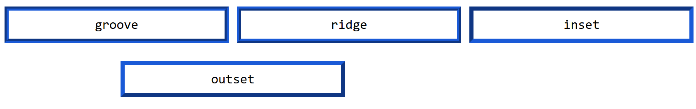

`border-color`:

- `значение` - любой цвет в любом цветовом формате

Если необходимо задать границу только с одной стороны, используется конкретное свойство:

- `border-top` - граница сверху
- `border-right` - граница справа
- `border-bottom` - граница снизу
- `border-left` - граница слева

И современный вариант для учета направления чтения в разных странах:

- `border-block-start` - граница по вертикали, начало направления (сверху)
- `border-block-end` - граница по вертикали, конец направления (снизу)
- `border-inline-start` - граница по горизонтали, начало направления (слева)
- `border-inline-end` - граница по горизонтали, конец направления (справа)
- `border-block` - шорткат границы по вертикали (верх-низ)
- `border-inline` - шорткат для границы по горизонтали (лево-право)

### `outline`

Шорткат для задания внешней границы элемента, не влияющей на его размеры.

`outline: [outline-width] [outline-style] [outline-color]`

`outline-width`:

- `thin`, `medium`, `thick` - тонкая, средняя и толстая ширина обводки (размер на усмотрение браузера).
- `значение` - конкретное значение в любых единицах измерения.

`outline-style`:

Классические обводки:

- `none` - обводка не отображается
- `dotted` - обводка из точек
- `dashed` - обводка в виде пунктирной линии
- `solid` - по умолчанию, сплошная линия
- `double` - двойная линия

Фигурные обводки (главное отличие от классических - наличие освещения сверху-вниз):

- `groove` - двойная двуцветная обводка в виде объемной фигуры.
- `ridge` - двойная двуцветная обводка в виде рамки.
- `inset` - объемная рамка с краями внутри элемента.
- `outset` - объемная рамка с краями снаружи элемента.


`outline-color`:

- `значение` - любой цвет в любом цветовом формате
- `invert` - максимально контрастный цвет, противоположный цвету фона элемента

> [!WARNING]
> `outline` не имеет свойств вроде `outline-left`, как это есть в `margin`, `padding` и `border`.
> Если необходимо задать внешнюю границу с конкретной стороны, то необходимо использовать `border` или обычную тень `box-shadow`.

### Схлопывание отступов

Пусть у двух блочных элементов задан внешний отступ:

- Первый элемент имеет отступ снизу в `10px`.
- Второй элемент имеет отступ сверху в `20px`.

```html
<div>
  <div class="first">Content 1</div>
  <div class="second">Content 2</div>
</div>
```

```css
* {
  box-sizing: border-box;
}

div {
  border: 1px solid black;
}

.first {
  margin-bottom: 10px;
}

.second {
  margin-top: 20px;
}
```

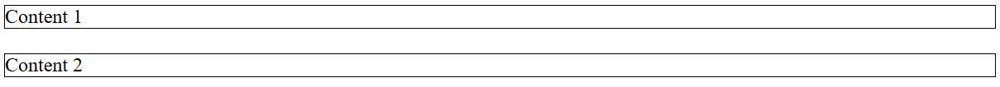

По логике отступы должны сложиться и получится общий отступ между элементами в `30px`, но этого не происходит:

- Высота каждого элемента `18px`, то есть `36px` занимают элементы в сумме.
- `margin` у каждого элемента указан верно по схемам:

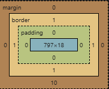 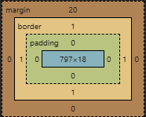

- Размер контейнера блоков на схеме составляет `60px`:

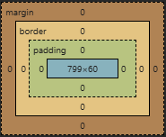

- Вычитаем из `60px` размеры друх блоков в сумме (`36px`) и `4px` на обводку, в результате получаем размер отступа в `20px`.

Произошло так называемое **схлопывание отступов**.

> [!NOTE]
> **Схлопывание отступов** происходит только для вертикальных (`margin-top` и `margin-bottom`) смежных блочных элементов в обычном потоке документа.
>
> Горизонтальные отступы (`margin-left` и `margin-right`) в обычном потоке **не схлопываются**, а суммируются.
>
> Однако в flexbox и grid-контейнерах вертикальные отступы тоже **не схлопываются** - это важно помнить!

Это не единственный случай, когда может произойти схлопывание:

- Схлопывание между родителем и потомком, если у них нет разделителя (нет `border` или `padding`, не задан `height` или отсутствует строчный элемент)

```html
<div class="parent">
  <div class="child">Content</div>
</div>
```

```css
.parent {
  margin-top: 20px;
}

.child {
  margin-top: 30px;
}
```

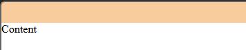

По идее у дочернего элемента должен быть свой отступ от родителя, но его нет.

## Размеры блочного элемента

- `width: значение` - ширина элемента в любых единицах измерения, 100% по умолчанию.
- `inline-size: значение` - современный вариант `width` для учитывания направления чтения в разных странах.
- `height: значение` - высота элемента в любых единицах измерения, auto по умолчанию.
- `block-size: значение` - современный вариант `height` для учитывания направления чтения в разных странах.

### Минимальные и максимальные размеры

Помимо задания фиксированной ширины/длины, имеется возможность задать минимальную и максимальную ширину/длину.

- `min-width: значение`
- `max-width: значение`
- `min-height: значение`
- `max-height: значение`

### Рассчет размеров элемента

По умолчанию блочные элементы имеют свойство `box-sizing: content-box`. Оно означает, что в размер элемента входит только ширина и высота.

Например, хотим задать два блока размером 100px:

```html
<div>Content 1</div>
<div>Content 2</div>
```

```css
div {
  width: 100px;
  height: 100px;
  border: 2px solid black;
  margin: 10px;
}
```

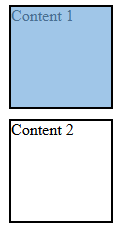

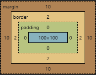

А теперь посмотрим на значение `box-sizing: border-box`:

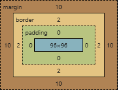

`4px` от размера элемента ушло на границу: `2px` на ширину и `2px` на высоту.

То есть использование свойства `box-sizing: border-box` задает браузеру правило, что внутренний отступ и граница должны включаться в размер элемента.

> [!WARNING]
> Существовало значение `padding-box`, но оно **устарело** и не поддерживается в современных браузерах. Используйте только `content-box` (по умолчанию) или `border-box`.

> [!TIP]
> Частой практикой идет использование свойства `border-box` в универсальном селекторе, чтобы переопределить стандартный рассчет размеров блочного элемента:
>
> ```css
> * {
>   box-sizing: border-box;
> }
> ```

## Стилизация

### `border-radius`

Закругление границ блочного элемента в любых единицах измерения

- `border-radius: [top-left] [top-right] [bottom-right] [bottom-left]` - для конкретных сторон
- `border-radius: значение` - для всех сторон
- `border-top-left-radius: значение` - для верхнего левого угла
- `border-top-right-radius: значение` - для верхнего правого угла
- `border-bottom-left-radius: значение` - для нижнего левого угла
- `border-bottom-right-radius: значение` - для нижнего правого угла

### `box-shadow: [inset] [сдвиг по x] [сдвиг по y] [радиус размытия] [растяжение] [цвет]`

Создание тени для блочного элемента

- `box-shadow: none` - отмена тени
- `box-shadow: inset [остальные параметры]` - тень выводится внетри элемента

> [!TIP]
> Проще всего воспользоваться <a href="https://active-vision.ru/box-shadow/" target="_blank">генератором теней</a>, который позволяет создать нужную тень, передвигая ползунки с параметрами свойства.

### `background: [background-attachment] [background-clip] [background-color] [background-image] [background-position] [background-repeat] [background-size]`

Шорткат для задания фона блочного элемента

`background-attachment`:

- `scroll` - фон привязан к элементу и движется вместе с ним при скролле. Если элемент имеет собственную прокрутку, фон при ней не двигается.
- `fixed` - фон зафиксирован к вьюпорту. Элемент движется, а фон остается на месте.
- `local` - фон привязан к содержимому элемента, скролится вместе с текстом в элементе, если у него есть прокрутка.

`background-clip`:

- `border-box` - по умолчанию, фон занимает все площадь элемента.
- `padding-box` - фон не заходит под рамку.
- `content-box` - фон ограничен только контентом блока, рамка и внутренние отступы не закрашиваются.
- `text` - фон обрезается по тексту, чтобы его стало видно, необходимо указать тексту свойство `color: transparent`.

`background-color`:

- `значение` - цвет фона в любом цветовом формате.

`background-image`:

- `url(путь), [url(путь)], ...` - в качестве фона выступает изображение. Можно указывать несколько изображений, тогда они будут накладываться друг на друга.
- `none` - сброс изображения.

`background-position`:

- `center`, `bottom`, `left`, `right` - позиция изображения, стороны можно комбинировать.
- `[top-left] [top]` - значение в любых единицах измерения, сначала от верхнего левого края, затем от верха.
- Подробнее про это свойство можно прочитать <a href="https://doka.guide/css/background-position/" target="_blank">здесь</a>.

`background-repeat`:

- `no-repeat` - не повторять фоновое изображение.
- `repeat` - повторять фоновое изображение до тех пор, пока оно не заполнит все необходимую область элемента.
- `repeat-x` - повторять только по горизонтали.
- `repeat-y` - повторять только по вертикали.
- `space` - повторение изображения, пока оно не заполнит пространство элемента. Если невозможно заполнить пространство без применения обрезки, то повторяющиеся изображения получают между собой отступ.
- `round` - попытка заполнить все пространство изображением с его повтором. Если не удается без обрезки, то применяется масштабирование.

`background-size`:

- `значение` - изменение размера изображения в любых единицах измерения.
- `auto` - размер изображения не меняется, по умолчанию.
- `cover` - масштабирование изображения с изменением пропорций под размер элемента.
- `contain` - масштабирование изображения без изменения пропорций под размер элемента.
