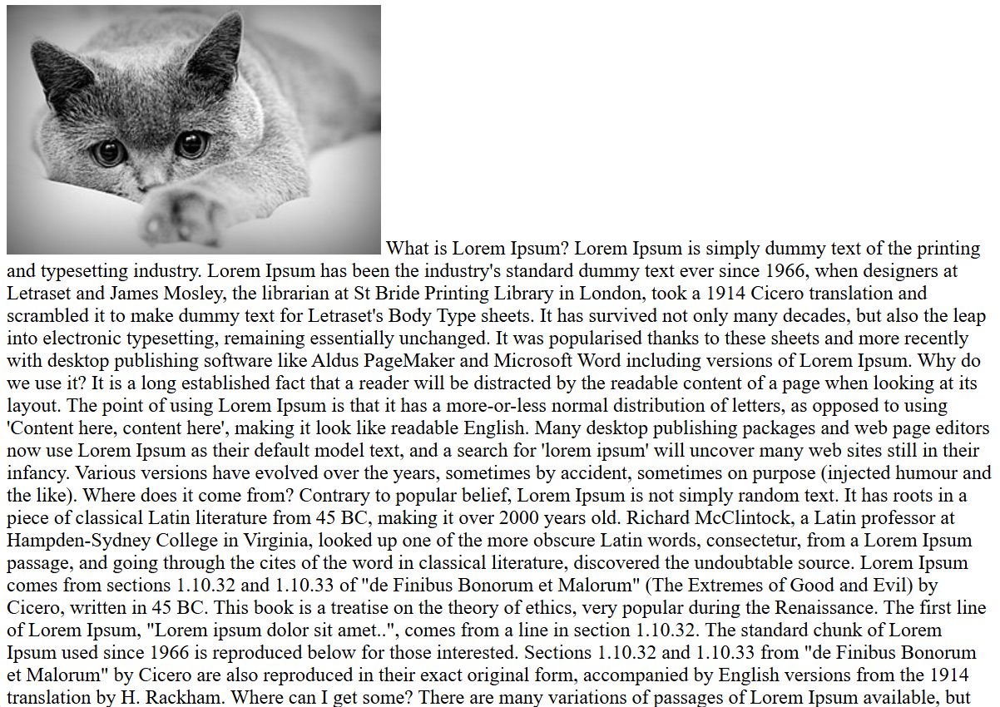
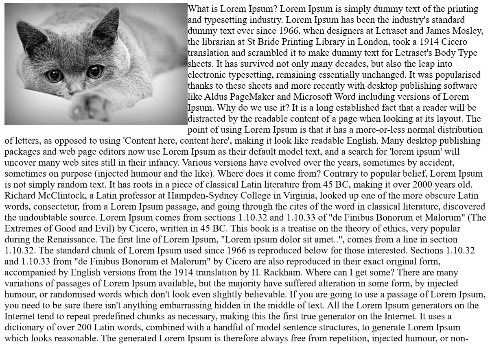
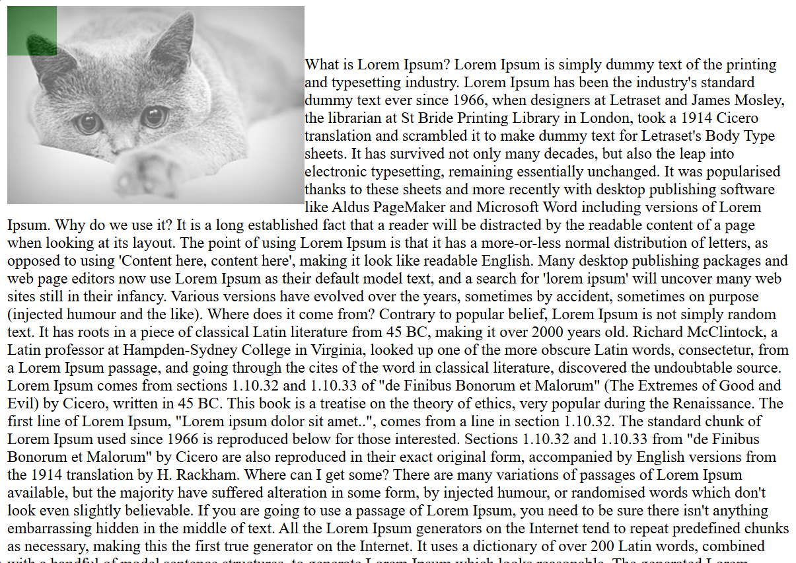
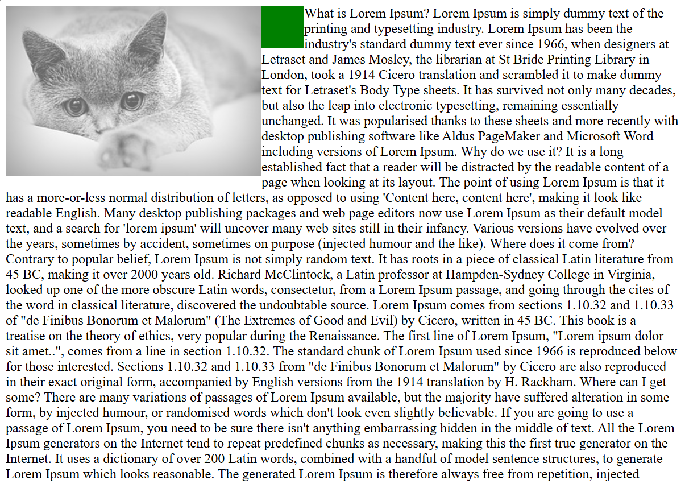
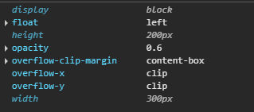
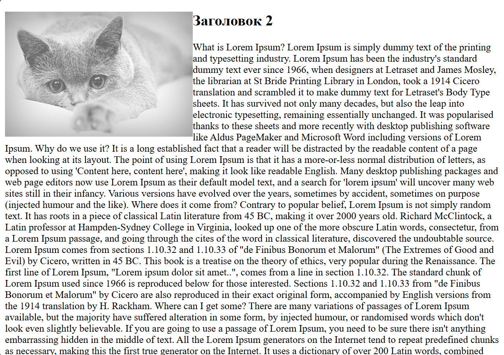
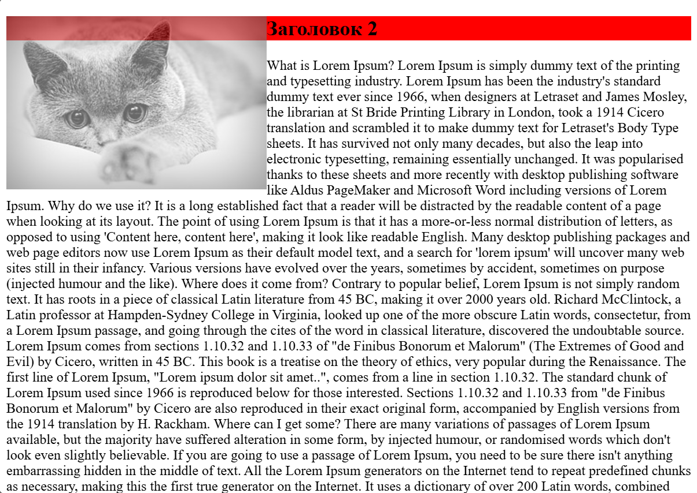
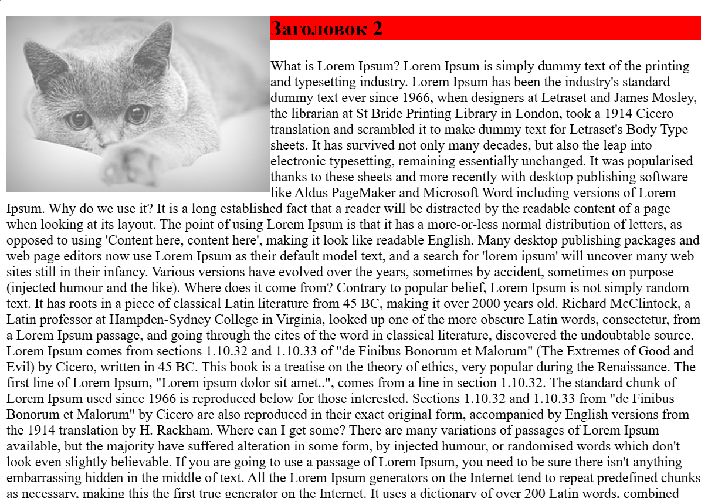
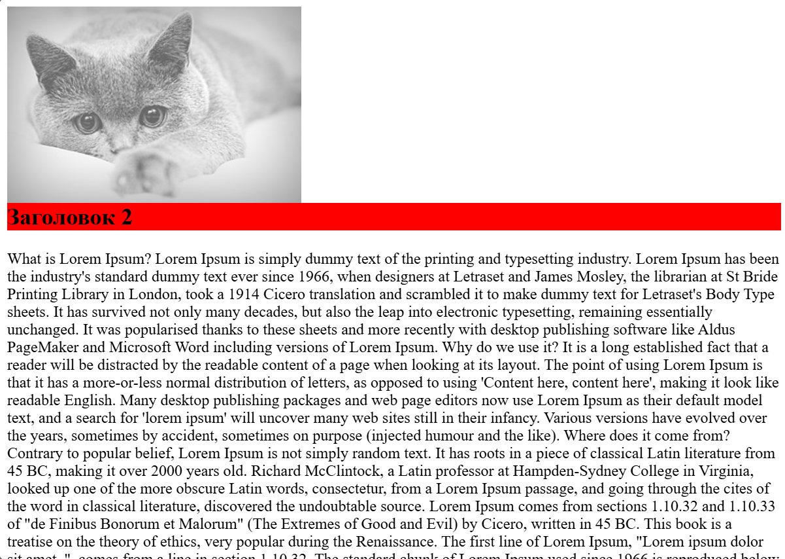

# Блочная верстка

[⬅️Назад](./6.%20Блочные%20vs%20строчные%20элементы.md) | [🏠Содержание](../README.md) | [Вперед➡️](./8.%20Позиционирование%20элементов.md)

В основе блочной верстки идет использование CSS свойства `float`, позволяющего задать обтекаемость элементу.

```html
<div>
  
  What is Lorem Ipsum? Lorem Ipsum...
</div>
```

Изображение является строчным элементом, поэтому оно встает в одну строку с текстом:



Теперь заданием свойство `float` изображению:

```CSS
img {
  float: left;
}
```

Текст стал находиться сверху рядом с изображением:



Добавим блочный элемент после изображения, а самому изображению добавим прозрачность:

```html
<div>
  
  <div class="block"></div>
  What is Lorem Ipsum? Lorem Ipsum...
</div>
```

```CSS
img {
  float: left;
  opacity: 0.6;
}

.block {
  width: 50px;
  height: 50px;
  background-color: green;
}
```

Блок оказался за изображением, а текст сместился по размеру этого блока:



> [!WARNING]
> Блочный элемент **игнорирует** обтекание, а строчный - нет.

Если добавить блочному элементу обтекание, то все будет работать как надо:

```CSS
.block {
  float: left;
  width: 50px;
  height: 50px;
  background-color: green;
}
```



> [!WARNING]
> Использование `float` автоматически назначает элементу `display: block`. В данном примере картинка стала блочным элементом.
>
> 

С заголовками тоже есть свои нюансы. Они являются блочными элементами, а значит, использование `float` тоже должно вызвать неожиданное поведение.

```html
<div>
  
  <h2>Заголовок 2</h2>
  What is Lorem Ipsum? Lorem Ipsum...
</div>
```

Заголовок не залез за изображение, как это было в примере с div-блоком:



Покрасим фон заголовка, чтобы понять ситуацию:

```CSS
h2 {
  background-color: red;
}
```

Заголовок все же находится за изображением, просто его текст начинается сразу после изображения:



Есть два пути решения этого поведения:

1. Использовать `overflow: hidden` на заголовке:

```css
h2 {
  background-color: red;
  overflow: hidden;
}
```



2. Использовать свойство `clear` на заголовке.

Оно позволяет отменить обтекаемость с определенной стороны:

- `left`, `right` - слева, справа
- `both` - с обоих сторон

```css
h2 {
  background-color: red;
  clear: both;
}
```

В таком случае заголовок перейдет на новую строку:



> [!WARNING]
> При работе с `float` становится необходимым высчитывать ширину элементов, так как при переполнении контейнера по ширине, float-элемент будет переноситься на следующую строку.
>
> Стоит также учитывать, что контейнер-родитель не получает высоты float-потомков, а значит, она будет равняться 0, если не задана явно или в контейнере нет других элементов без `float`.
>
> Решаются эта проблема следующим образом:
>
> - Указанием `overflow: hidden` для родительского элемента
> - Использованием `clear: both` на псевдоэлементе `::after`
>
> Второй пункт пишется следующим образом:
>
> ```css
> /* Родитель + псевдоэлемент ::after */
> .wrapper::after {
>   content: "";
>   clear: both;
>   display: block;
> }
> ```
