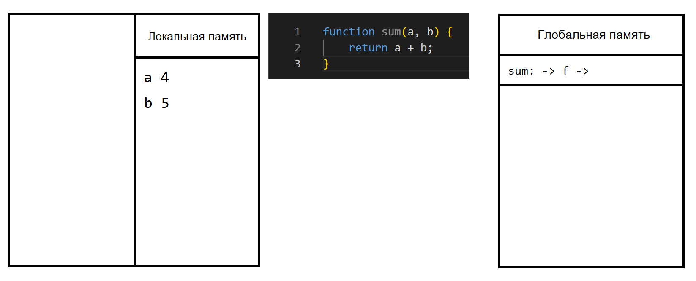
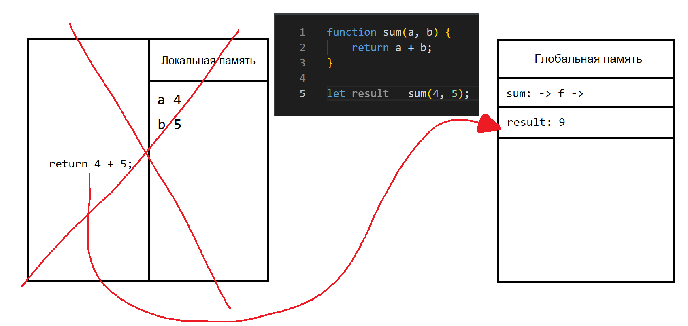

# Лексическое окружение и замыкание

[⬅️Назад](./8.%20Функции.md) | [🏠Содержание](../README.md) | [Вперед➡️](./10.%20Продвинутая%20работа%20с%20функциями.md)

## Контекст вызова функции (execution context) и области видимости функции (scope)

Контекст вызова функции (execution context) создается при вызове функции.
При передаче параметров, они копируются в локальную область видимости функции.

Затем значение функции в операторе `return` записывается в переменную `result`, которое хранится в глобальной области видимости, а локальная область видимости функции удалится:

